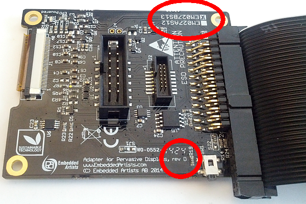
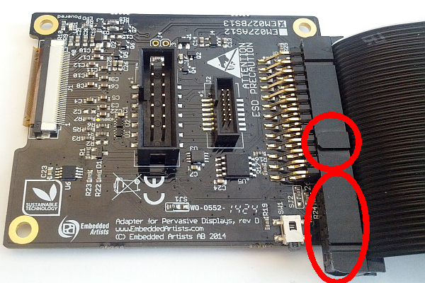
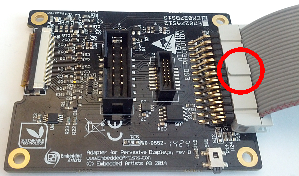

# E-Ink Driver for: Raspberry Pi

Table of contents

* [Prerequisites](#prerequisites)
* [Preparations](#preparations)
* [Connecting Raspberry Pi to the ePaper board](#connecting-raspberry-pi-to-the-epaper-board)
  * [Raspberry Pi 2, A+ and B+ models](#raspberry-pi-2-a-and-b-models)
  * [Raspberry Pi A and B models](#raspberry-pi-a-and-b-models)
* [Standalone EPD Test Program](#standalone-epd-test-program)
* [EPD Driver](#epd-driver)
  * [Starting EPD Driver at Boot](#starting-epd-driver-at-boot)
* [Python Examples](#python-demo-programs---directory-demo)
  * [Drawing Demo](#drawing-demo)
  * [Image Demo](#image-demo)
  * [Image Demo with button](#image-demo-with-button)
  * [Partial Demo](#partial-demo)
  * [Counter Demo](#counter-demo)
  * [Clock Demo 1](#clock-demo-1)
  * [Clock Demo 2](#clock-demo-2)
  * [IP Address Demo](#ip-address-demo)
  * [Barcode Demo](#barcode-demo)

## Prerequisites

The code in this repository is **ONLY VALID** on ePaper modules that are **rev D** and have the **EM027BS013** display mounted.
To see what your module has, look at the back of it:

The board in the image above is rev D (as shown in one of the circles) and it is a EM027BS013 display, shown by an X next to the name. If the board is rev D but the two checkboxes for EM027AS12/EM027BS13 are missing, then it is assumed that it is a EM027BS13 display.

If your board is not rev D or if it is a rev D board with an EM027AS12 mounted, then go to the [product page](http://www.embeddedartists.com/products/displays/lcd_27_epaper.php) and look under **EM027AS012** in the table.

## Preparations

The new Raspberry Pi 2 (and possibly the A+ and B+ models as well) come with the option to enable and disable SPI communication. It is off by default. To enable it run the following command:

~~~~~
sudo raspi-config
~~~~~

In the dialog that appears, navigate to Advanced Options and then SPI. Select to enable it. The question about loading driver at startup does not matter. Reboot.

## Connecting Raspberry Pi to the ePaper board

### Raspberry Pi 2, A+ and B+ models

The A+, B+ and version 2 models come with 40 gpio pins. You can use a 40-pin ribbon cable and connect part of it like this:

Note that the keying must be as shown in the images for the pins to align correctly. As the cable is 40 pins and the pin list is 26, 14 pins will stick out. Make sure they stick out on the side as shown above.

###  Raspberry Pi A and B models

The A and B models come with 26 gpio pins. You can use a 26-pin ribbon cable and connect it like this:

Note that the keying must be as shown in the images for the pins to align correctly.

## Standalone EPD Test Program

This will first clear the panel then display a series of images (all
2.7" images from Arduino example).  This need the Linux SPI module
installed. 

Start by loading the SPI module. Old installations of Raspbian Wheezy use
the `spi-bcm2708` module, while newer installations of Raspbian Wheezy and
Raspbian Jessie use `spi-bcm2835`. Load the version that you need:

~~~~~
sudo modprobe spi-bcm2708
~~~~~

Build and run using:

~~~~~
COG_VERSION=V2 make rpi-epd_test
sudo ./driver-common/epd_test 2.7
~~~~~

## EPD Driver

The EPD driver needs the fuse development library installed.

~~~~~
# Raspberry Pi
sudo apt-get install libfuse-dev
~~~~~

The EPD driver allows the display to be represented as a virtual director of files, which are:

~~~~~
File         Read/Write   Description
--------     -----------  ---------------------------------
version      Read Only    The driver version number
panel        Read Only    String describing the panel and giving its pixel width and height
current      Read Only    Binary image that  matches the currently displayed image (big endian)
display      Read Write   Image being assembled for next display (big endian)
temperature  Read Write   Set this to the current temperature in Celsius
command      Write Only   Execute display operation
BE           Directory    Big endian version of current and display
LE           Directory    Little endian version of current and display
~~~~~

~~~~~
Command   Byte   Description
--------  -----  --------------------------------
'C'       0x43   Clear the EPD, set `current` to all zeros, `display` is not affected
'U'       0x5A   Erase `current` from EPD, output `display` to EPD, copy display to `current`
~~~~~

Notes:

* The default bit ordering for the display is big endian i.e. the top left pixel is
  the value 0x80 in the first byte.
* The `BE` directory is the same as the root `current` and `display`.
* The `LE` directory `current` and `display` reference the top left pixel as 0x01
  in the first byte.
* The `current_inverse` and `display_inverse` represent black as zero (0) and white as one (1)
  while those item without the suffix represent the display's natural coding (0=>white, 1=>black)
* The particular combination of `BE/display_inverse` is used in the Python EPD demo
  since it fits better with the Imaging library used.

Start by loading the SPI module. Old installations of Raspbian Wheezy use
the `spi-bcm2708` module, while newer installations of Raspbian Wheezy and
Raspbian Jessie use `spi-bcm2835`. Load the version that you need:

~~~~~
sudo modprobe spi-bcm2708
~~~~~

Build and run using:

~~~~~
COG_VERSION=V2 make rpi-epd_fuse
sudo mkdir /tmp/epd
sudo ./driver-common/epd_fuse --panel=2.7 -o allow_other -o default_permissions /tmp/epd
~~~~~

Verify that it worked by checking version and panel type, should return `3` and `EPD 2.7 264x176 COG 2`

~~~~~
cat /tmp/epd/version
cat /tmp/epd/panel
~~~~~

Clear screen:

~~~~~
echo C > /tmp/epd/command
~~~~~

Send image to display and update display to show it:

~~~~~
./driver-common/xbm2bin < ./driver-common/cat_2_7.xbm > /tmp/epd/display
echo U > /tmp/epd/command
~~~~~

To shut down:

~~~~~
sudo umount -f /tmp/epd
sudo rmdir /tmp/epd
~~~~~

### Starting EPD Driver at Boot

To have the EPD driver loaded automatically after a reboot, a startup script 
must be installed in in `/etc/init.d` and the driver must be installed in `/usr/sbin`.
There is a make target that does this.

~~~~~
sudo COG_VERSION=V2 make rpi-install
sudo service epd-fuse start
~~~~~

The service places the files under `/dev/epd/` instead of `/tmp/epd/` so to see the files:

~~~~~
ls -l /dev/epd
~~~~~

To stop the service temporarily:

~~~~~
sudo service epd-fuse stop
~~~~~

To start the service again:

~~~~~
sudo service epd-fuse start
~~~~~

To permanently preventing EPD driver to start at boot (note that this command
must be executed when the service is running, i.e. you should **not** do a `sudo service epd-fuse stop`
first):

~~~~~
sudo COG_VERSION=V2 make rpi-remove
~~~~~

## Python Demo Programs - directory "demo"

These need the PIL library installed:

~~~~~
# Raspberry Pi
sudo apt-get install python-imaging
~~~~~

The examples also need the [Starting EPD Driver at Boot](#starting-epd-driver-at-boot)

### Drawing Demo

Draw some lines, graphics and text

~~~~~
python demo/DrawDemo.py
~~~~~

### Image demo

* Accepts a lists of image files on the command line.
* Converts them to grey scale to ensure formats like PNG, JPEG and GIF will work.
* Inverts the image since the E-Ink panel is reverse (i.e. black on white).
* Converts image to single bit (PIL "1" mode).
* Display the middle of the image (using crop function).
* Delay.
* Display the re-sized image.
* Delay before fetching next file.

Note if scratch is installed on the system, the following commands will
show some cartoon animals.  The images when re-sized will be distorted
if the aspect ration of the original image is not the same as the
display.

~~~~~
python demo/ImageDemo.py /usr/share/scratch/Media/Costumes/Animals/cat*
python demo/ImageDemo.py /usr/share/scratch/Media/Costumes/Animals/d*.png
~~~~~

### Image demo with button
> See: [How to use GPIO on Raspberry Pi](http://makezine.com/projects/tutorial-raspberry-pi-gpio-pins-and-python/)

This demo works in the same way as the other Image demo but instead of
always waiting 3 seconds between each update it is now possible to advance
to the new image using the button on the display board.

Note that to access the GPIO library needed for the button the program
must be executed with root privileges:

~~~~~
sudo python demo/ImageDemoButton.py /usr/share/scratch/Media/Costumes/Animals/cat*
sudo python demo/ImageDemoButton.py /usr/share/scratch/Media/Costumes/Animals/d*.png
~~~~~

### Partial Demo

Display random overlapping rectangles using partial update.  First
argument is number of rectangle to generate before updating the EPD,
second number is the number of frames to display before the program
exits.

~~~~~
python demo/PartialDemo.py 3 20
~~~~~

### Counter Demo

Display a 4 digit hex counter uses partial update to only change the
updated digits. 

Use *Ctrl-C* to stop this program.

~~~~~
python demo/CounterDemo.py 3 20
~~~~~

### Clock Demo 1

Displays the current time (in minutes), date and weekday. Updates
every minute to show the current time.

Use *Ctrl-C* to stop this program.

~~~~~
python demo/Clock27.py
~~~~~

### Clock Demo 2

Displays the current time (in secodns) and date. Updates
every five seconds to show the current time. Note that this demo
will almost continuously update the display so it will be a constant
flicker.

Use *Ctrl-C* to stop this program.

~~~~~
python demo/ClockDemo.py
~~~~~

### IP Address Demo

Displays the current IP address and gateway. If the network connection
is lost the display will instead show a *Not Connected* message until
the connection is restored again.

Use *Ctrl-C* to stop this program.

~~~~~
python demo/IpAddrDemo.py
~~~~~

### Barcode Demo

Generates and displays two bar codes. See more information in the [./demo/barcode/](https://github.com/embeddedartists/gratis/tree/master/PlatformWithOS/demo/barcode/) subfolder.

This program must be executed from inside the `./demo/barcode/` folder and with a special command:

~~~~~
PYTHONPATH=.. python BarCodeDemo.py
~~~~~

